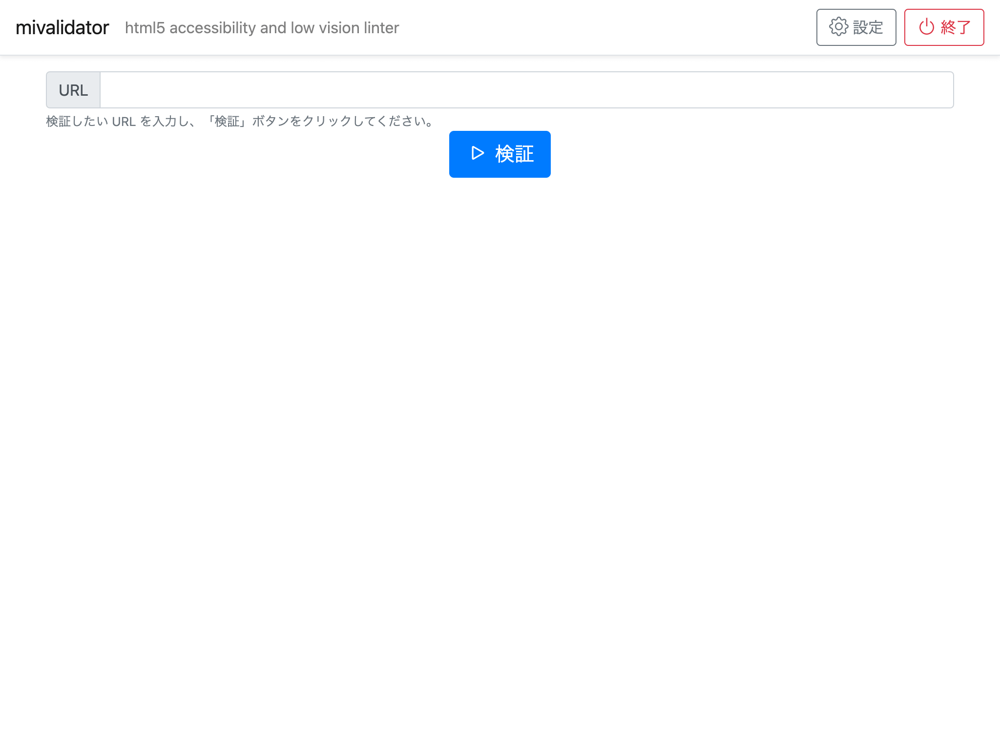

# mivalidator

mivalidator は HTML のマークアップを検証するアプリケーションです。
[総務省の「みんなのアクセシビリティ評価ツール：miChecker」](https://www.soumu.go.jp/main_sosiki/joho_tsusin/b_free/michecker.html)
（以下 miChecker という）を改変し、最新の Java で、モダンブラウザを用いて動作するようにし、Windows 以外でも動作するようにしたものです。
動作環境の違いを下表に示します。

|          | michecker             | mivalidator（本アプリケーション） |
|----------|-----------------------|----------|
| Platform | Windows               | Windows, MacOS, Linux |
| Java     | Java8 32bit           | Java11 64bit |
| ブラウザ   | Internet Explorer 11 | Google Chrome |
| ライセンス | EPL-1.0               | EPL-2.0 |

さらに miChecker ではCMS等連携用ツールとして htmlchecker が提供されていましたが、mivalidator は htmlchecker 相当の機能を組み込んでおり、別途ツールを導入する必要はありません。

## 事前準備

### 共通

実行には Java11 が必要です。お使いの OS によって適切な方法でインストールしておいてください。

### Windows または Mac

Google Chrome をインストールしてください。
[Google Chrome のインストールページ](https://www.google.com/chrome/) へアクセスし、表示される手順にしたがってください。

### Linux

Google Chrome のオープンソース版である Chromium Browser をインストールしてください。
お使いの Linux ディストリビューションによってインストール方法が異なります。各ディストリビューションに適した方法で Chromium Browser をインストールしてください。

なお、追加で日本語フォントをインストールする必要がある場合が多いです。不明な場合は日本語フォントもインストールしてください。
最近は、日本語フォントとして IPA ゴシックか、Google Noto Sans かのどちらかが主流だと思います。
お好みに応じてどちらかをインストールしてください。

## インストール方法

最新版をダウンロードし、任意のディレクトリに展開してください。

## アプリケーションの実行方法

Windows をご利用の方はコマンドプロンプトか PowerShell を実行し、mivalidator を展開したディレクトリへ移動してください。
Mac や Linux をご利用の方はターミナルを実行し、mivalidator を展開したディレクトリへ移動してください。

~~~
cd <mivalidator を展開したディレクトリ>
~~~

次に `bin/mivalidator` を実行してください。

~~~
bin/mivalidator
~~~

以下のような画面が表示されれば起動に成功です。

チェックしたいページの URL を検証欄へ入力し、検証ボタンをクリックしてみてください。

## 解析ツールとしての実行方法

コマンドプロンプトやターミナルから次のように実行します。

~~~
bin/mivalidator --no-interactive "http://検証したページのURL"
~~~

カレントディレクトリに JSON 形式で解析結果が出力されます。

## 開発者向け情報

miChecker は Eclipse を利用して開発するしかありませんでしたが、mivalidator は gradle プロジェクトなので任意のエディタを利用して開発することができます。
各自開発に必要な環境をインストールしてください。

### ソースコードの取得

GitHub より取得することができます。次のコマンドを実行します。

~~~
git clone https://github.com/mivalidator/mivalidator.git
~~~

実行すると `mivalidator` ディレクトリ以下にソースコード一式がダウンロードされます。

### 実行

次のコマンドを実行すると、mivalidator が起動します。

~~~
./gradlew run
~~~

### ビルド

次のコマンドでリリース物をビルドすることができます。

~~~
./gradlew clean assembleDist
~~~

このコマンドを実行すると `build/distributions/` ディレクトリ以下に `mivalidator.tar` と `mivalidator.zip` の 2 つのファイルが作成されます。
これらのファイルには実行に必要なファイル一式が含まれています。

## ライセンス

[EPL-2.0](https://choosealicense.com/licenses/epl-2.0/)
